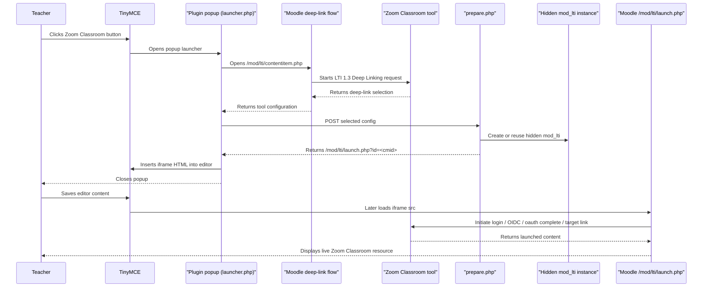

# Zoom Classroom TinyMCE Plugin Architecture and Technical Deep Dive

## Purpose

The `tiny_zoomclassroom` plugin adds a **Zoom Classroom** button to Moodle's TinyMCE editor and connects that button to a preconfigured **LTI 1.3 Deep Linking** tool.

Its job is to:

- launch the Zoom Classroom deep-link picker
- receive the selected deep-linked resource
- create or reuse a hidden backing Moodle `mod_lti` instance
- insert embeddable editor content that launches through Moodle's normal **LTI 1.3 OIDC flow**

## High-level idea

This plugin does **not** ask teachers to manually create a visible Moodle `mod_lti` activity.

Instead, it:

1. uses Moodle's deep-linking flow to let a teacher select content
2. receives Moodle's interpreted tool configuration for that selected item
3. creates or reuses a hidden backing `mod_lti` activity/module
4. stores an iframe in the editor
5. points that iframe at Moodle's standard `/mod/lti/launch.php?id=<cmid>` entrypoint
6. lets Moodle perform the normal OIDC initiate-login → auth → tool launch sequence

## Main components

### PHP

- `settings.php`
  - admin settings
  - chooses which Moodle external tool registration is used

- `classes/plugininfo.php`
  - controls whether the Tiny plugin is enabled
  - injects runtime config into TinyMCE

- `launcher.php`
  - popup page opened from TinyMCE
  - starts the deep-link picker flow
  - handles the returned Moodle deep-link result in JavaScript

- `prepare.php`
  - AJAX endpoint
  - validates the selected deep-link config
  - creates or reuses a hidden backing `mod_lti` instance
  - returns a Moodle `/mod/lti/launch.php?id=<cmid>` URL

### JavaScript

- `amd/src/ui.js`
  - opens the popup from TinyMCE

- JavaScript embedded in `launcher.php`
  - receives deep-link return data
  - calls `prepare.php`
  - inserts iframe HTML into TinyMCE

### Moodle core LTI

- `/mod/lti/contentitem.php`
  - standard Moodle deep-link selection entrypoint

- `/mod/lti/contentitem_return.php`
  - standard Moodle deep-link return processing

- `/mod/lti/locallib.php`
  - core helper functions for:
    - deep-link request building
    - tool configuration extraction
    - LTI launch generation

## End-to-end sequence

## Runtime configuration flow

When TinyMCE is rendered, `classes/plugininfo.php` provides configuration to the editor:

- selected tool id
- course id
- launcher path
- sesskey
- popup dimensions
- UI strings

This configuration is used by `amd/src/ui.js` to open the correct popup flow.

## Deep-link selection flow

### 1. Teacher clicks the TinyMCE button

The Tiny plugin:

- checks the configured LTI tool
- resolves the course id
- opens `launcher.php` in a popup

Relevant files:

- `amd/src/ui.js`
- `classes/plugininfo.php`

### 2. Popup starts the Moodle deep-link flow

`launcher.php` embeds Moodle's standard deep-link selection endpoint:

- `/mod/lti/contentitem.php`

That means the plugin now relies on Moodle's built-in deep-link behavior instead of rebuilding the entire selection flow itself.

### 3. Moodle converts the selected content into tool config

After the Zoom Classroom tool returns the selected deep-linked content, Moodle processes it using core LTI logic.

Important detail:

- Moodle does **not** return already-rendered HTML for a live launch
- It returns a **tool configuration object**
- This is the same kind of data Moodle uses when configuring an LTI resource link

That returned config may include:

- `name`
- `toolurl`
- `securetoolurl`
- `instructorcustomparameters`
- grade-related settings
- icon-related settings

## Why a backing `mod_lti` instance is needed

Deep linking selects content.

It does **not** by itself create a running LTI launch inside the editor body.

For a correct LTI 1.3 launch, Moodle should begin at the tool's **OIDC initiate-login URL**, continue through Moodle auth handling, then land at the selected target link URI.

The plugin therefore cannot simply iframe the target link URI directly.

Instead, after selection it must transform the returned config into a real Moodle External tool instance so launches can later go through:

- `/mod/lti/launch.php`
- initiate login
- `/mod/lti/auth.php`
- tool OAuth completion
- final target link URI

## `prepare.php` responsibilities

`prepare.php` is called by the popup after Moodle has returned the selected content configuration.

It:

- validates `sesskey`
- checks course permissions
- ensures the configured tool is LTI 1.3
- extracts the returned tool configuration fields we care about
- creates or reuses a hidden backing `mod_lti` instance
- returns a Moodle `/mod/lti/launch.php?id=<cmid>` URL

That launch URL is what gets inserted into TinyMCE as the iframe `src`.

## Backing `mod_lti` responsibilities

The hidden backing module stores the selected resource configuration in a real Moodle `lti` record and `course_modules` entry.

That allows Moodle core to handle the real launch path using:

- `/mod/lti/launch.php`
- `lti_initiate_login(...)`
- `/mod/lti/auth.php`
- standard LTI 1.3 OIDC completion

## Important distinction: deep linking vs launch

### Deep linking

Used when the teacher is choosing content.

Message type:

- `ContentItemSelectionRequest`

Returned by tool as:

- `LtiDeepLinkingResponse`

### Launch

Used when the saved editor content is later rendered.

Message type:

- normal LTI launch

This second step is what actually displays the chosen Zoom Classroom resource.

## Data persistence model

### Stored by this plugin

Only admin settings:

- selected tool id
- popup width
- popup height

### Not stored in plugin tables

- no custom DB tables
- no custom persistence layer for teacher selections

### Persisted in Moodle content

The thing that is ultimately saved is the editor HTML, including the inserted iframe pointing to `/mod/lti/launch.php?id=<cmid>`.

### Persisted in Moodle core tables

The selected resource is also persisted in Moodle core `lti` / `course_modules` data because the plugin creates or reuses a hidden backing `mod_lti` instance.

So the selected resource is persisted in two practical places:

- the saved TinyMCE iframe HTML
- the hidden backing Moodle External tool instance

## Security model

### Current controls

- plugin is limited to users with appropriate course capabilities
- popup entry requires `sesskey`
- backing module creation requires `sesskey`
- backing module creation checks course capabilities
- plugin is intentionally restricted to **LTI 1.3 only**
- final launch goes through Moodle's standard LTI 1.3 launch controller

### Trust boundary

The configured external tool is assumed to be trusted by the Moodle administrator.

That is an important public-release assumption and should be documented.

## Why the success message appeared earlier

The message:

- `Successfully fetched tool configuration from the selected content.`

comes from Moodle's standard deep-link return path.

That message means:

- the deep-link selection succeeded
- Moodle successfully parsed the returned content into a tool configuration object

It does **not** mean Moodle has already performed the final launch into the editor.

The plugin's extra `prepare.php` bridge is what turns that successful selection into a real hidden Moodle LTI module and a live embedded launch.

## Known limitations

- This is an editor-embedded launch pattern backed by hidden Moodle `mod_lti` activities
- It depends on the returned deep-link item including enough launchable data to create a launchable resource link
- The inserted content is iframe-based
- Behavior may vary depending on what Zoom Classroom returns in the deep-link response

## Suggested future improvements

- add automated PHPUnit and JS coverage
- add stronger validation of required returned fields before allowing insertion
- document exactly which deep-link response shapes are supported
- consider lifecycle management for hidden backing `mod_lti` records
- add a diagnostics mode for admins to inspect selected deep-link config safely

## File reference map

- `settings.php`
- `classes/plugininfo.php`
- `amd/src/ui.js`
- `launcher.php`
- `prepare.php`
- `mod/lti/contentitem.php`
- `mod/lti/launch.php`
- `mod/lti/contentitem_return.php`
- `mod/lti/locallib.php`
