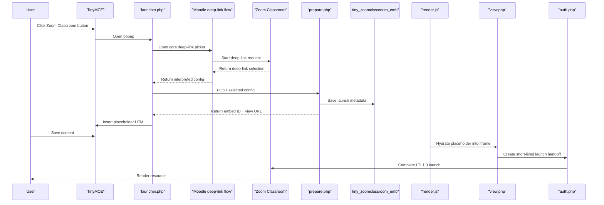
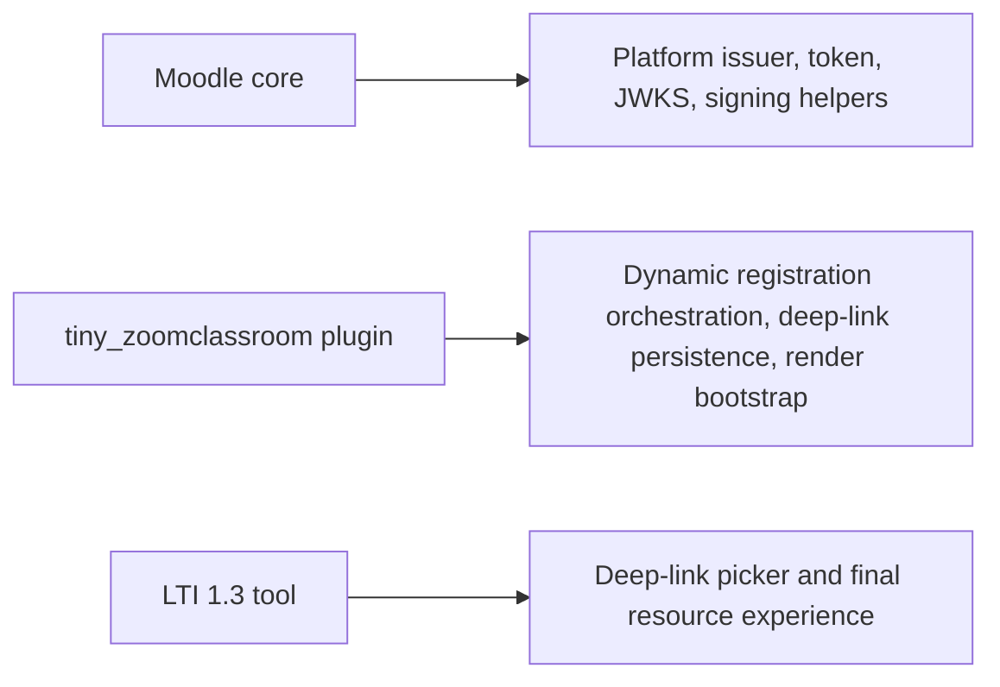

# Zoom Classroom TinyMCE Plugin Architecture and Technical Deep Dive

## Purpose

`tiny_zoomclassroom` adds a **Zoom Classroom** button to **Moodle 5+** TinyMCE editors and connects that button to a registered **LTI 1.3 Deep Linking** tool.

Its responsibilities are to:

- start deep linking from TinyMCE
- reuse Moodle's LTI platform trust material where appropriate
- validate the returned launch configuration
- persist launch metadata server-side
- store only an opaque embed reference in editor HTML
- render the selected resource later through a normal LTI 1.3 OIDC launch

The plugin does **not** create user-visible `mod_lti` activities for each selected resource.

## Core design

The current design is intentionally split into two layers:

1. **Selection time**
   - Moodle deep linking returns a selected LTI resource configuration
   - the plugin validates and normalizes it
   - the plugin stores that launch metadata in its own table
   - the editor receives only an opaque embed ID

2. **Render time**
   - saved content contains a placeholder node
   - plugin JavaScript hydrates the placeholder into an iframe
   - the iframe loads plugin `view.php`
   - `view.php` and `auth.php` complete the LTI 1.3 launch against the configured tool

This keeps saved editor content small and avoids storing the full launch descriptor directly in the HTML field.

## Trust model

The plugin reuses Moodle as the LTI platform for:

- issuer: Moodle `$CFG->wwwroot`
- token endpoint: `/mod/lti/token.php`
- JWKS endpoint: `/mod/lti/certs.php`
- signing helpers from Moodle's LTI subsystem

The plugin owns these TinyMCE-specific endpoints:

- `openid-configuration.php`
- `openid-registration.php`
- `startregistration.php`
- `auth.php`
- `view.php`
- `prepare.php`
- `launcher.php`

This means Zoom Classroom sees Moodle as the trusted platform identity, while the plugin owns only the editor-specific orchestration.

## Tool compatibility and customization assumptions

The plugin is designed to work with a standards-compliant **LTI 1.3 Deep Linking** tool.

That means the plugin expects the tool to:

- support standard LTI 1.3 initiate-login and message launch behavior
- support standard Deep Linking request and response handling
- return valid deep-linking content items, including an LTI resource launch URL or a tool-level fallback launch URL

The plugin does **not** require a custom Zoom Classroom-specific return protocol for:

- deep-link selection
- placeholder insertion
- saved-content rendering
- final embedded launch

Instead, the plugin owns the Moodle-side orchestration:

- it starts dynamic registration using plugin-owned endpoints
- it receives the selected deep-link result through Moodle's standard deep-linking flow
- it persists the selected launch metadata server-side
- it later performs a normal LTI 1.3 launch through plugin-owned `view.php` and `auth.php`

Stated differently:

- the **tool** remains a normal LTI 1.3 Deep Linking tool
- **Moodle core** still provides issuer, token, JWKS, and signing primitives
- the **plugin** provides the editor-safe persistence and render orchestration layer

## Main components

### Admin and registration flow

- `register.php`
  - admin UI for dynamic registration and configured-tool management
- `startregistration.php`
  - starts IMS LTI Dynamic Registration using plugin-owned OpenID configuration
- `openid-configuration.php`
  - advertises Moodle issuer, token, and JWKS, plus plugin auth/registration endpoints
- `openid-registration.php`
  - creates or updates the Moodle LTI 1.3 tool record

### Deep-link selection flow

- `launcher.php`
  - popup page opened from TinyMCE
  - embeds Moodle's core deep-linking flow
- `prepare.php`
  - receives the returned deep-link configuration
  - validates URL and tool assumptions
  - persists launch metadata server-side
  - returns an opaque embed ID and launch bootstrap URL

### Render and launch flow

- `view.php`
  - authenticated bootstrap for later rendering
  - loads server-side launch metadata by opaque embed ID
  - stores a short-lived session handoff
  - posts an initiate-login request to the tool
- `auth.php`
  - completes the LTI 1.3 authorization handoff
  - uses Moodle signing helpers to generate the final launch form
- `placeholder.php`
  - returns a stable placeholder image used to keep non-empty editor content durable across Moodle/TinyMCE save paths

### Shared helpers

- `locallib.php`
  - URL allowlist validation
  - launch config normalization
  - embed record persistence helpers
- `classes/hook_callbacks.php`
  - loads the global renderer on Moodle pages
- `lib.php`
  - legacy fallback for loading the renderer on older page paths

### JavaScript

- `amd/src/plugin.js`
  - TinyMCE integration
  - hydrates placeholders while editing
  - dehydrates editor HTML before save without mutating the visible editor surface
- `amd/src/render.js`
  - converts saved placeholders into live iframes
  - supports late DOM insertion via `MutationObserver`

## Persistence model

### Database

The plugin stores launch metadata in:

- table: `tiny_zoomclassroom_emb`

Each record contains:

- `publicid`
- `courseid`
- `toolid`
- `title`
- `launchconfigjson`
- `timecreated`
- `timemodified`

`publicid` is the only identifier placed into saved editor HTML.

### Saved editor HTML

Saved HTML contains a placeholder similar to:

```html
<div class="tiny_zoomclassroom-embed" data-title="LTI 1.3" data-embed-id="tzc_...">
  <div class="tiny_zoomclassroom-preview">LTI 1.3</div>
  
</div>
```

Important details:

- the HTML contains an opaque reference only
- the actual launch metadata stays server-side
- the placeholder image exists to keep Moodle/TinyMCE submission paths from treating the field as empty

## Data layers

The design intentionally separates data by layer so saved Moodle content does not need to hold full LTI launch metadata.

| Layer | What is stored | Where it lives | Purpose | Trust / sensitivity |
|---|---|---|---|---|
| Moodle LTI tool configuration | client ID, auth URLs, JWKS-related registration values, deployment mapping | Moodle core tables such as `lti_types` and related core config | defines the registered LTI 1.3 tool the plugin uses | admin-managed trust anchor; sensitive configuration but not stored by the plugin itself |
| Deep-link selection response | title, launch URL, custom params, resource link details returned by the tool | transient popup / request payload during selection | source material used to create a stable embed record | untrusted until validated and normalized by the plugin |
| Plugin embed metadata | `publicid`, `courseid`, `toolid`, `title`, `launchconfigjson`, timestamps | plugin table `tiny_zoomclassroom_emb` | canonical server-side record used for later launches | trusted only after plugin validation; should be treated as launch-sensitive server-side state |
| Saved Moodle HTML field | placeholder markup, `data-embed-id`, hidden sentinel image reference | Moodle editor-backed content fields | durable editor-safe reference to the embed | intentionally low sensitivity; contains opaque pointer only |
| Browser render state | hydrated iframe URL, editor DOM state, preview markup | browser DOM during editing or page view | turns saved placeholder back into live embedded content | derived state; not authoritative |
| Launch handoff state | short-lived launch state tied to user session and selected embed | Moodle session | bridges `view.php` to `auth.php` securely | transient, session-bound, launch-sensitive |
| Final LTI launch request | signed JWT claims and launch form fields | generated server-side at launch time and posted to the tool | completes the LTI 1.3 resource launch | sensitive runtime state; not persisted in saved editor HTML |

### Data ownership by layer

- **Moodle core owns**
  - platform issuer
  - token endpoint
  - JWKS endpoint
  - tool registration records
- **The plugin owns**
  - editor-facing registration workflow
  - deep-link response validation and normalization
  - server-side embed persistence
  - launch handoff orchestration
- **The tool owns**
  - deep-link picker behavior
  - resource launch destination
  - post-launch application behavior

## Data flow

The data path is intentionally one-way:

1. the tool returns a deep-link selection
2. the plugin validates and normalizes that selection
3. the plugin stores the normalized launch metadata server-side
4. Moodle content stores only an opaque embed reference
5. runtime rendering resolves that opaque reference back to a validated server-side launch record
6. the plugin performs a normal LTI 1.3 launch using Moodle's platform identity

### Data flow diagram

```mermaid
flowchart LR
    A["Tool deep-link response"] --> B["prepare.php validation and normalization"]
    B --> C["Plugin DB: tiny_zoomclassroom_emb"]
    C --> D["Saved Moodle HTML placeholder"]
    D --> E["render.js hydration"]
    E --> F["view.php"]
    F --> G["Session launch handoff"]
    G --> H["auth.php"]
    H --> I["Signed LTI 1.3 launch"]
    I --> J["Tool resource render"]
```



### Trust boundaries in the data flow

- **Boundary 1: Tool to plugin**
  - the deep-link response originates outside Moodle
  - `prepare.php` treats it as untrusted input
  - the plugin validates version, tool mapping, URL constraints, and launch assumptions before persistence
- **Boundary 2: Plugin DB to saved HTML**
  - only `publicid` crosses into saved editor content
  - raw launch metadata stays server-side
- **Boundary 3: Saved HTML to runtime launch**
  - `render.js` reads only the opaque embed ID from the saved markup
  - `view.php` resolves that ID back to trusted server-side state
- **Boundary 4: Session handoff to final launch**
  - `view.php` creates short-lived, session-bound launch state
  - `auth.php` validates that state before generating the signed launch

### Why the saved HTML is intentionally minimal

Storing only an opaque embed reference in saved HTML gives the design a few benefits:

- it avoids exposing the full launch descriptor in Moodle content fields
- it reduces the risk of teachers or students copying launch metadata between contexts
- it allows the plugin to re-check course access and tool configuration at render time
- it keeps launch-sensitive details in a server-side record that can be invalidated or deleted centrally

## End-to-end flow



## Responsibility boundaries



In practice:

- **Moodle core** remains the LTI platform foundation
- **the plugin** makes that platform usable inside TinyMCE without creating duplicate `mod_lti` activities
- **the tool** remains a normal standards-based LTI 1.3 deep-linking tool rather than a plugin-specific integration surface

## Deep-link selection details

### `launcher.php`

`launcher.php` opens Moodle's standard content-item flow:

- `/mod/lti/contentitem.php`

That is intentional. The plugin does not replace Moodle's content-selection UI; it wraps it so the returned selection can be persisted in a TinyMCE-safe way.

### `prepare.php`

`prepare.php` receives the tool configuration chosen through deep linking and:

- validates `sesskey`
- requires Moodle login
- ensures the configured tool is LTI 1.3
- validates returned launch URLs against the configured allowlist
- falls back to the registered tool URL when the selected item omits a resource-level URL
- normalizes the launch config
- stores it in `tiny_zoomclassroom_emb`

Response payload:

- `embedid`
- `launchurl`
- `title`

The opaque ID is then written into editor HTML.

## Render-time launch details

### `render.js`

The renderer runs in three important contexts:

1. inside TinyMCE while editing
2. on normal Moodle display pages
3. on pages where Moodle injects content after initial load, such as grading views

It:

- finds `.tiny_zoomclassroom-embed` containers
- extracts `data-embed-id`
- replaces preview text with an iframe targeting plugin `view.php`
- watches later DOM insertions with `MutationObserver`

### `view.php`

`view.php`:

- loads the launch config from the opaque ID
- requires course login
- checks that the mapped tool is still LTI 1.3
- creates a short-lived session handoff
- posts an OIDC initiate-login request to the tool's `lti_initiatelogin` URL

### `auth.php`

`auth.php`:

- validates launch-state presence and TTL
- validates `client_id`
- validates `redirect_uri` against the configured Moodle tool
- validates login/session assumptions
- uses Moodle's LTI helper functions to sign the final launch request

For plugin-owned embedded launches it creates a pseudo LTI instance rather than a visible course module.

## Why this design avoids duplicate activities

The plugin does **not** create a dedicated `mod_lti` activity for each selected asset.

That matters because:

- creating visible or stealth `mod_lti` records for editor embeds introduces course-module lifecycle problems
- it can confuse teachers and students with duplicate activities
- it ties editor rendering to course-module assumptions that do not fit all TinyMCE contexts

Instead, the plugin uses:

- Moodle core for deep-link selection
- plugin storage for embed persistence
- Moodle core signing helpers for launch

## Security posture

The current design improves the earlier implementation by:

- removing full launch metadata from saved editor HTML
- replacing it with an opaque ID
- keeping authorization checks server-side at render time

Runtime protections still include:

- Moodle authentication
- course access checks in `view.php`
- tool version checks
- redirect URI validation
- launch-domain allowlisting
- short-lived session handoff state

## Limitations

- the plugin currently supports one configured Zoom Classroom tool per site
- the placeholder image approach is still a compatibility workaround for Moodle/TinyMCE save behavior

## Recommended next improvements

- add automated coverage for:
  - teacher insert flow
  - student submission flow
  - grader display flow
- add a cleanup path for orphaned embed metadata records
