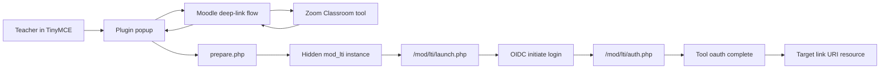

# Zoom Classroom TinyMCE Plugin Security Review Guide

## Audience

This document is for security reviewers who are familiar with:

- LMS platforms
- Moodle
- LTI 1.3

but are not yet familiar with the implementation details of the `tiny_zoomclassroom` plugin.

## Executive summary

`tiny_zoomclassroom` is a Moodle TinyMCE plugin that:

1. lets a teacher deep-link Zoom Classroom content into TinyMCE
2. creates or reuses a hidden backing Moodle `mod_lti` instance for the selected asset
3. renders the selected content through Moodle's normal **LTI 1.3 OIDC launch flow**

The plugin itself does **not** contain hardcoded secrets, client secrets, or private keys.

The most important security characteristics are:

- it is restricted to **LTI 1.3 only**
- it relies on Moodle core for the actual launch and OIDC behavior
- it creates hidden `mod_lti` records in Moodle for selected assets
- it may persist selected resource URLs and tool-returned custom parameters in Moodle core data, depending on tool behavior

## Scope

This review covers the plugin at:

- `tiny_zoomclassroom`

It does **not** cover:

- the Zoom Classroom tool implementation itself
- the security of Moodle core
- the correctness of an institution's Moodle deployment or access model

## Plugin purpose

The plugin adds a **Zoom Classroom** button to TinyMCE and launches a configured Moodle External tool registration that supports **LTI 1.3 Deep Linking**.

After content is selected, the plugin creates or reuses a hidden backing `mod_lti` instance and inserts iframe HTML pointing to:

- `/mod/lti/launch.php?id=<cmid>`

This means final rendering uses Moodle's standard LTI 1.3 launch controller instead of a custom direct-to-tool shortcut.

## Trust boundaries

The main trust boundaries are:

### 1. Browser ↔ Moodle

- Teacher interacts with TinyMCE and the popup
- Plugin actions are protected with Moodle `sesskey`
- Inserted content is saved as part of standard Moodle editor content

### 2. Moodle ↔ configured external tool

- Moodle performs the deep-linking request
- Moodle receives the deep-link response
- Moodle later performs the real OIDC launch for the backing `mod_lti` instance

### 3. Plugin ↔ Moodle core LTI subsystem

The plugin delegates core security-sensitive LTI behavior to Moodle core:

- deep-link request initiation
- OIDC initiate-login flow
- `/mod/lti/auth.php`
- module-backed launch flow

### 4. Moodle DB persistence

The plugin persists data indirectly through Moodle core records:

- hidden `mod_lti` records
- `course_modules` rows
- saved TinyMCE iframe HTML

## High-level security architecture

## Authentication and authorization

## Authentication

The plugin assumes Moodle user authentication is already handled by Moodle.

For the actual LTI launch, authentication to the external tool follows Moodle's standard LTI 1.3 OIDC flow via:

- `/mod/lti/launch.php`
- initiate login
- `/mod/lti/auth.php`
- tool auth completion

## Authorization

The plugin performs capability checks before allowing deep-link creation behavior.

Relevant checks include:

- `moodle/course:manageactivities`
- `mod/lti:addcoursetool`
- `mod/lti:addpreconfiguredinstance`

These checks are used to restrict who can:

- see/use the button in a meaningful context
- create backing hidden `mod_lti` instances
- complete the selected content flow

## Data inventory

### Plugin-owned persistent data

The plugin does **not** define custom database tables.

Persistent plugin configuration is limited to admin settings such as:

- selected tool id
- popup width
- popup height

### Moodle-core persistent data created by the plugin

The plugin creates or reuses hidden `mod_lti` records and matching `course_modules` records.

Observed persisted fields include:

- `typeid`
- `name`
- `toolurl`
- `securetoolurl` (if present)
- `instructorcustomparameters` (if present)
- `cm.idnumber` used as a dedupe key

### Editor content persistence

The TinyMCE content saved in Moodle contains iframe HTML pointing to:

- `/mod/lti/launch.php?id=<cmid>`

### Data not observed in repo or current DB sample

In the current sample backing records, the following were empty / not stored:

- `resourcekey`
- `password`
- `icon`
- `secureicon`
- `instructorcustomparameters`

## Sensitive data assessment

## Source repository

A source scan of the plugin did **not** find:

- API secrets
- client secrets
- private keys
- `.env` files
- hardcoded bearer tokens

## Persisted Moodle data

The plugin can persist environment-specific resource URLs through `toolurl`.

This is not a secret by itself, but it may still be sensitive from an internal-environment disclosure perspective, especially if:

- the environment is non-public
- the path reveals identifiers or object IDs

## Custom parameters

The most important data element to flag for review is:

- `instructorcustomparameters`

The plugin passes through tool-returned custom parameters into the hidden backing `mod_lti` instance if present.

Implication:

- if the external tool returns sensitive custom parameters, Moodle may persist them

Current observed DB sample:

- no custom parameters were present

Reviewer action:

- validate whether the external tool ever returns secrets or sensitive claims in custom parameters

## Input validation and request protection

### CSRF protection

The plugin uses Moodle `sesskey` protections on its state-changing flow.

Examples:

- popup entry
- `prepare.php`

### Tool restriction

The plugin only supports:

- **LTI 1.3**

LTI 1.1 is intentionally rejected.

### Capability enforcement

Before creating backing resources, the plugin checks relevant course capabilities.

### No custom secret material in code

The plugin does not embed tool credentials or platform secrets.

## Use of Moodle core security controls

The plugin intentionally relies on Moodle core for the actual LTI 1.3 launch path.

This is a positive design choice because it avoids inventing a parallel OIDC implementation inside the plugin.

Security-sensitive behaviors delegated to Moodle include:

- OIDC login initiation
- launch state/session handling
- `/mod/lti/auth.php`
- final launch behavior

## Hidden backing `mod_lti` instances

This is the most important implementation-specific behavior for review.

### Why they exist

They are used so the inserted editor content can launch through Moodle's standard `mod_lti` flow.

### Security implications

- selected resource configuration is persisted in Moodle core tables
- lifecycle management matters
- accumulation of stale hidden records is possible

### Current behavior

- dedupe is based on a stable hash in `cm.idnumber`
- modules are hidden and not shown on the course page

### Review questions

- Is hidden module accumulation acceptable?
- Should there be cleanup, rotation, or ownership tracking?
- Should these records be tagged more explicitly for auditing or deletion?

## Threat considerations

## 1. Malicious or overly-trusting tool output

If the external tool returns unexpected launch configuration or unsafe custom parameters, the plugin may persist them into backing `mod_lti` data.

Mitigation:

- admin trust in the configured tool
- LTI 1.3-only scope
- Moodle-core launch path

Residual risk:

- tool-returned configuration is still an important trust boundary

## 2. Environment disclosure

Stored `toolurl` values may reveal internal or non-production environment URLs.

Mitigation:

- treat DB exports carefully

Residual risk:

- environment URLs may still appear in Moodle DB backups/exports

## 3. Hidden module sprawl

Repeated deep-link use may increase hidden `mod_lti` records over time.

Mitigation:

- dedupe key reduces duplicates for identical selections

Residual risk:

- long-term lifecycle management is still an operational concern

## 4. Unauthorized content insertion

If a user without proper permissions could invoke the creation flow, they might create backing instances improperly.

Mitigation:

- capability checks
- `sesskey` checks

## Current code areas relevant to review

- `classes/plugininfo.php`
- `amd/src/ui.js`
- `launcher.php`
- `prepare.php`
- `mod/lti/launch.php`
- `mod/lti/auth.php`
- `mod/lti/locallib.php`

## Reviewer checklist

- Confirm the plugin stores no custom secrets in source
- Confirm only trusted LTI 1.3 tools can be configured
- Confirm capability checks are sufficient for intended teacher/admin roles
- Confirm persisted `toolurl` values are acceptable from an environment disclosure standpoint
- Confirm external tool does not return sensitive `custom` / `instructorcustomparameters`
- Confirm hidden backing `mod_lti` lifecycle is acceptable
- Confirm Moodle backups/exports handling is acceptable given persisted launch URLs
- Confirm OIDC launch path uses Moodle core and not a custom direct-to-tool shortcut

## Recommended follow-up actions

- Add explicit lifecycle/cleanup strategy for hidden backing `mod_lti` instances
- Add tests around deep-link config validation and backing module creation
- Optionally add admin diagnostics for backing records created by this plugin
- Document operational expectations for DB exports and environment URLs
- Verify with the Zoom Classroom team that returned custom parameters never contain secrets

## Bottom line

At present, the plugin appears to be in a reasonable place for security review because:

- no hardcoded secrets were found in the repo
- current sampled backing DB records did not contain credentials or custom parameters
- the final launch path uses Moodle's standard LTI 1.3 OIDC flow

The primary review focus should be:

- persistence of tool-returned launch configuration
- lifecycle of hidden backing `mod_lti` instances
- trust assumptions around the configured external tool
